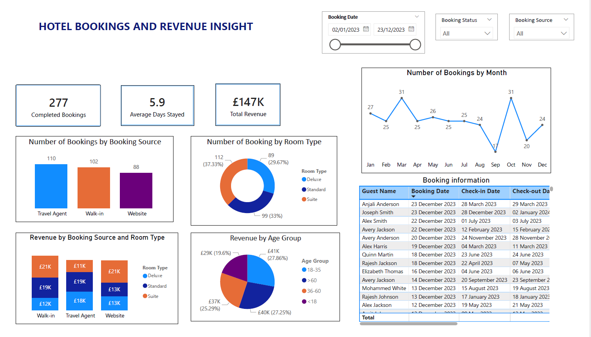

## PowerBI-Hotel-Revenue-dashboard preview

## Project Overview
This dashboard was created to provide insights into hotel booking trends over a year 2025 across different site, demographic characteristics of guests and revenue generated

## Objectives
To inform better resource planning, marketing strategies, in order to increase customer satisfaction  and optimize renvenue

## Tool used
Power BI
Excel
DAX

## Key insigght 
Hotel received more bookings through Travel agencies. The booking peeks in March and October, while the rate is at the lowest in September and November

The total anual revenue was £147K and Hotel suits generate more revenue compared to other room types. The guest age group 18 - 35 contributed highly to the revenue.
